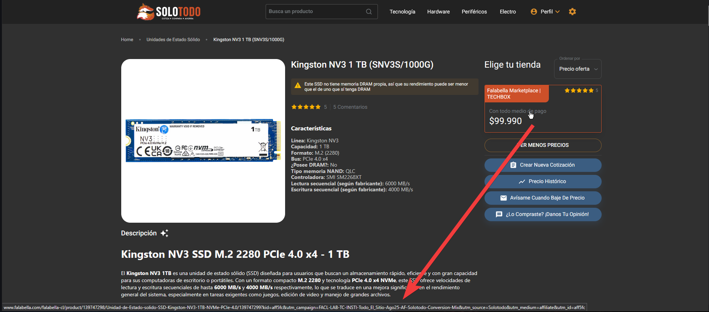
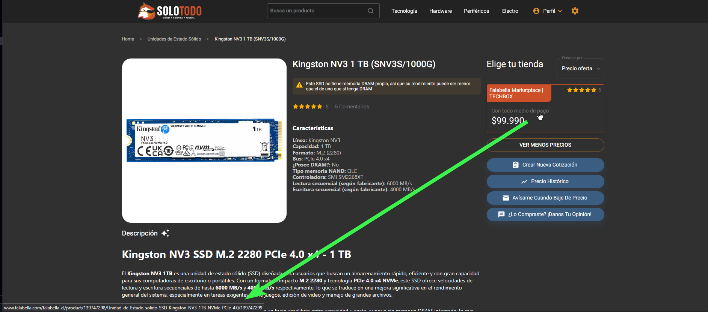

# Solotodo Limpiar Referidos Plox

Limpia enlaces redirigidos y parámetros de seguimiento a productos de https://www.solotodo.cl

## Descripción

```Markdown
> Tú entras a https://www.solotodo.cl
> Abres pagina de producto
> Script detecta URL de tienda con referido "ad.soicos.com/-1uGJ?dl=https://www......."
> Script limpia URL de tienda "https://www........"
> Tú cargas sitio sin comprometer tu privacidad :)
```

## 🛠️ Requisitos

Necesitas un gestor de scripts de usuario como:

- [Violentmonkey](https://violentmonkey.github.io/)
- [Tampermonkey](https://www.tampermonkey.net/)
- [Greasemonkey](https://www.greasespot.net/)

## 📦 Instalación

1. Instala un gestor de userscripts (ver arriba)
2. 📥 [Haz clic aquí para instalar el script](https://raw.githubusercontent.com/Alplox/Solotodo-Limpiar-Referidos-Plox/refs/heads/main/solotodo-limpiar-referidos-plox.user.js)

## Ejemplo







## ¿Por qué?

Quitar los **parámetros de seguimiento** (como `ad.soicos`, `utm_source`, etc.) antes de cargar un enlace tiene varios beneficios importantes, tanto para la **privacidad** como para el **rendimiento** y la **experiencia de usuario**.

---

### **Beneficios de eliminar parámetros de seguimiento de un enlace**

#### **1. Mayor privacidad**

- Los parámetros de seguimiento permiten que empresas y plataformas sigan tu comportamiento entre sitios web.
- Al eliminarlos, reduces la cantidad de información que se comparte sobre ti con anunciantes o servicios analíticos.
- Evita que se generen perfiles de usuario basados en tus clics.

---

#### **2. Menos riesgo de filtración de datos**

- Algunos parámetros pueden contener información sensible: IDs de usuario, campañas internas, tokens temporales.
- Si compartes el enlace sin esos parámetros, reduces el riesgo de exponer datos.

---

#### **3. Enlaces más limpios y fáciles de compartir**

- Un enlace sin parámetros es:

  - Más corto
  - Más legible
  - Menos propenso a romperse
- Facilita compartirlo por chat, documentos, redes sociales, etc.

---

#### **4. Carga más rápida de la página (en algunos casos)**

- Algunos parámetros activan scripts de analítica o redirecciones adicionales.
- Quitarlos puede reducir:

  - Redirecciones innecesarias
  - Cargas de scripts de seguimiento
  - Tiempo hasta mostrar la página

No siempre es una diferencia enorme, pero puede notarse.

---

#### **5. Mayor consistencia al guardar enlaces**

- Si guardas un enlace (favoritos, notas, documentos) sin parámetros:

  - Aseguras que siga funcionando aunque la campaña de seguimiento termine.
  - Evitas enlaces distintos para la misma página según el origen.

---

#### **6. Mejora la privacidad de quienes lo reciben**

- Si compartes el enlace a otra persona, sin querer puedes “pasarle” rastreadores que la identifican como proveniente de ti.
- Al limpiarlo, proteges también la privacidad de otros.

---

#### **7. Evita que sistemas de seguimiento inflen métricas**

- Para equipos de marketing o analítica:

  - Compartir enlaces con parámetros internos puede contaminar datos de tráfico.
- Enlaces limpios → datos más confiables sobre usuarios reales.

---

## 📄 Licencia

Este proyecto está bajo la licencia MIT. Consulta el archivo [LICENSE](./LICENSE) para más detalles.
